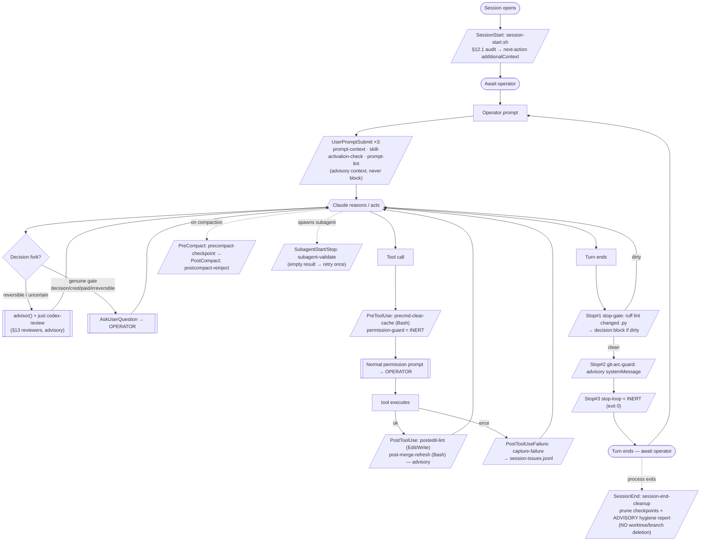
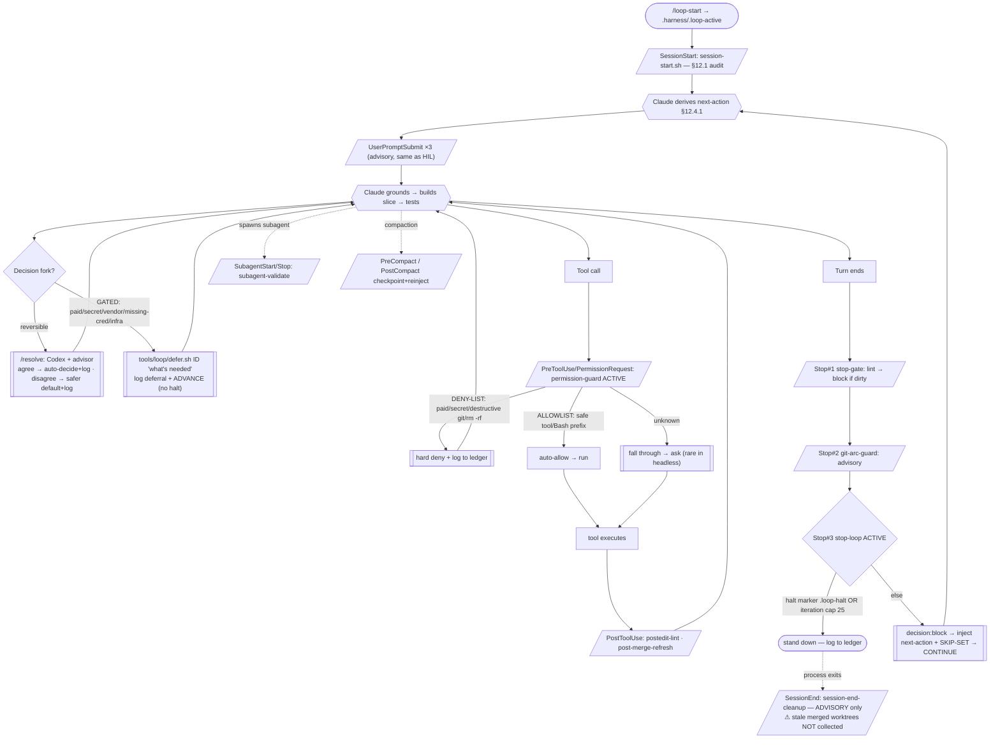

# Hook + Skill + Advisor workflow — as-built review

*Review of the autonomy/automation surface that landed from
`~/.claude/plans/let-s-brainstorm-adding-additional-recursive-taco.md` (Waves 1–3,
U-HK-01..25). Authoritative trigger map = `.claude/settings.json`; behavior = each
hook's body. Mode-agnostic / process-substrate. 2026-06-03. Read-only review — no
code changed.*

---

## 0. The three layers

| Layer | What it is | Who fires it | Can it block / auto-act? |
|---|---|---|---|
| **Hooks** | Shell scripts wired to Claude Code lifecycle *events* in `settings.json`. | The **harness** (deterministic, not Claude). | Some emit `decision:block` or a permission `allow/deny`; most are advisory `additionalContext`. |
| **Skills** | Slash-command playbooks Claude *invokes* (`/loop-start`, `/resolve`, …). | **Claude** (on operator command or skill-trigger). | They drive Claude's behavior; they don't intercept events. |
| **Advisor / Codex / Council** | Decorrelated *reviewers* Claude calls at decision-forks (§13). | **Claude** (a tool call / skill). | Advisory — they inform Claude's decision; they never auto-act. |

The load-bearing distinction: **hooks are the harness reacting to events; skills + advisor are Claude reaching for help.** Pre-Wave-4, only **two** hooks changed behavior between HIL and loop mode (`permission-guard`, `stop-loop`). Wave 4 originally made `loop-gc.sh` mode-sensitive; later parity hardening superseded that behavior: SessionStart is report-only in every mode, while explicit post-merge/closeout and `/loop-start` calls own safe reaping (see §10).

---

## 1. Authoritative trigger map (`settings.json`)

> **§§1–9 are the PRE-WAVE-4 baseline** — the as-built snapshot the reconciliation reviewed. **Wave 4 then changed the wiring** (see §10): SessionStart gained a second hook **`tools/hooks/loop-gc.sh`** (worktree GC, after the audit); a **`statusLine`** = `tools/statusline/context-recovery.sh` was added; and explicit `timeout`s landed on the blocking Stop + UserPromptSubmit hooks. Read §1's map together with §10 for the current state.

| Lifecycle event | Hook(s), in order | Loop-gated? |
|---|---|---|
| **SessionStart** `*` | `roadmap-audit/session-start.sh` (no) → **`loop-gc.sh`** *(Wave 4, later hardened)* | no; **loop-gc is report-only in every mode** |
| **UserPromptSubmit** | `prompt-context.sh` → `skill-activation-check.sh` → `prompt-lint.sh` | no |
| **PreToolUse** `Bash` | `precmd-clear-cache.sh` | no |
| **PreToolUse** `*` | `permission-guard.sh` | **YES — inert off-loop** |
| **PermissionRequest** `*` | `permission-guard.sh` | **YES — inert off-loop** |
| **PostToolUse** `Bash` | `roadmap-audit/post-merge-refresh.sh` | no |
| **PostToolUse** `Edit\|Write\|MultiEdit` | `postedit-lint.sh` | no |
| **PostToolUseFailure** `*` | `capture-failure.sh` | no |
| **PreCompact** `*` | `precompact-checkpoint.sh` | no |
| **PostCompact** `*` | `postcompact-reinject.sh` | no |
| **SubagentStart** `*` | `subagent-validate.sh` | no |
| **SubagentStop** `*` | `subagent-validate.sh` | no |
| **Stop** `*` | `stop-gate.sh` → `git-arc-guard.sh` → `stop-loop.sh` | partly (`stop-loop` is loop-gated) |
| **StopFailure** `*` | `capture-failure.sh` | no |
| **SessionEnd** `*` | `session-end-cleanup.sh` | no |

---

## 2. Hook reference (purpose · action · guardrails)

### Always-on (fire identically in HIL + loop)

**`session-start.sh`** — `SessionStart`. Runs the §12.1 roadmap audit: computes `workspace_state_hash`, compares to the dashboard, recognizes the §12.2.1 fixed-point lag, injects the next-action (or a DRIFT flag) as `additionalContext` (<50 tokens). *Guardrail:* always exit 0; failures encoded in context, never a silent skip. Advisory.

**`prompt-context.sh`** — `UserPromptSubmit`. Re-injects the roadmap next-action + a cheap local drift proxy on *every* prompt (SessionStart fires only once; state drifts as PRs land). *Guardrail:* non-blocking, no network (30s budget); the real audit stays at SessionStart.

**`skill-activation-check.sh`** — `UserPromptSubmit`. When a `/cmd` is typed, verifies it resolves to a known project/user/built-in skill; if not but near-misses a real one → "did you mean" hint. *Guardrail:* **silent-when-correct** (a legit-but-unknown command never false-warns); always exit 0.

**`prompt-lint.sh`** — `UserPromptSubmit`. Flags a bare contentless prompt ("fix it", lone "it") and suggests naming a target+outcome. *Guardrail:* deliberately conservative — must EXACTLY equal a small deictic set; every idiom ("continue", "ship it", "yes") + every `/cmd` stays silent. Advisory.

**`precmd-clear-cache.sh`** — `PreToolUse(Bash)`. Before a pytest/pyright/uv-run/just-test command, clears the repo's own `__pycache__`/`*.pyc` (the stale-`.pyc` trap, §14.3). *Guardrail:* non-blocking (clears then lets the command run, no permission decision); scoped to repo source (excludes `.venv`/`.git`/`node_modules`/worktrees); bounded.

**`postedit-lint.sh`** — `PostToolUse(Edit|Write|MultiEdit)`. Runs `ruff` on the edited `.py` file, injects findings. *Guardrail:* **non-blocking** (PostToolUse can't undo — informs only; the Stop gate + CI ruff are the hard enforcement); silent when clean; bounded.

**`post-merge-refresh.sh`** — `PostToolUse(Bash)`. After a `gh pr merge`, detects "a substantive PR merged → terminating refresh owed", pre-computes the new state-hash, injects the §12.2 checklist. *Guardrail:* **does not edit the dashboard** (that needs judgment); emits ONLY when origin advanced past the pinned head to a non-`ops: roadmap status refresh` commit (noise discipline). Advisory.

**`capture-failure.sh`** — `PostToolUseFailure` + `StopFailure`. Logs tool failures + API/turn errors (esp. `max_output_tokens`, `rate_limit`) to gitignored `.harness/session-issues.jsonl`; nudges a memory entry on a recurring (≥2) signature. *Guardrail:* StopFailure output is ignored by Claude Code → there it only logs; the memory nudge emits only on PostToolUseFailure.

**`precompact-checkpoint.sh`** — `PreCompact(manual|auto)`. Writes a state snapshot to `.harness/.checkpoints/precompact-latest.md` so essentials survive compaction. *Guardrail:* wired **synchronously** (the PostCompact reader must not race it); the one slow `gh` call is bounded; gitignored.

**`postcompact-reinject.sh`** — `PostCompact`. After compaction, surfaces the checkpoint pointer + next-action + a nudge to re-run the §12.1 audit. *Guardrail:* context-only (cannot block); concise to avoid double-injection with `SessionStart(source=compact)`.

**`subagent-validate.sh`** — `SubagentStart` + `SubagentStop`. Start: injects a "return a concrete non-empty result" contract reminder (advisory). Stop: if the subagent's final message is empty/whitespace → `decision:block` ONCE to force a retry. *Guardrail:* `stop_hook_active` prevents infinite retry; FAIL-OPEN on transcript-shape; a **quality gate** only — never auto-approves a tool / bypasses a permission.

**`stop-gate.sh`** — `Stop` (#1 of 3). On turn end with uncommitted `.py` changes, runs a FAST ruff lint on just those files; failing → `decision:block` so Claude fixes lint before stopping. *Guardrail:* `stop_hook_active` checked FIRST (blocks at most once per chain); fast tier only — heavy test/typecheck stays in CI + the loop's pre-merge full check.

**`git-arc-guard.sh`** — `Stop` (#2 of 3). ADVISORY hygiene mirror: flags uncommitted changes / unpushed commits / local default-branch-behind-origin (the §12.1 stale-main hazard). *Guardrail:* prints a `systemMessage` and exits 0 — **never** `decision:block`, never auto-approves; **not** an autonomy mechanism. *(Note: does NOT touch worktree lifecycle — the gap under discussion.)*

**`session-end-cleanup.sh`** — `SessionEnd`. Prunes old precompact snapshots (keeps 10 newest); writes an **advisory** git-hygiene report (merged local branches, worktree list, MEMORY.md cap) to `.harness/.checkpoints/session-end-report.md`. *Guardrail:* **does NOT auto-delete branches/worktrees** — "destructive ops stay explicit." Merged-branch detection cross-refs `gh` merged head-refs (squash-safe). *(Note: report lands in a file SessionEnd output can't surface → effectively invisible; plan description said "prune" but AC + as-built are advisory-only — the drift under discussion.)*

### Loop-gated (behavior changes between HIL and loop)

**`permission-guard.sh`** — `PreToolUse(*)` + `PermissionRequest(*)`. THE autonomy blast-radius limiter. Tri-state, fail-safe: **(1) INERT unless loop mode** → exit 0, normal manual approval. **(2) DENY-LIST first** (even in loop) → paid calls / secret relocation / destructive-irreversible git / recursive delete → hard `deny` + log to ledger. **(3) ALLOWLIST** → known non-destructive tools + safe Bash prefixes → `allow`. **(4) everything else** → exit 0 → falls through to the normal "ask" prompt. *Guardrail:* deny-list checked BEFORE allowlist (a dangerous flag on an allowlisted verb like `git push --force` is still blocked); unknown == ask, never auto-allow.

**`stop-loop.sh`** — `Stop` (#3 of 3). In loop mode, keeps the roadmap arc going across turns: at turn end injects the next-action + `decision:block` to continue. STOPS only at: **INERT off-loop** (exit 0); **HALT MARKER** `.harness/.loop-halt` (a true stand-down — forward menu exhausted or operator stopped; a single gated item does NOT raise it); **ITERATION CAP** `HARNESS_LOOP_MAX` (default 25 — the hard turn-counter bound); otherwise increment + block with next-action + the run-scoped SKIP-SET (advances past already-deferred items). *Guardrail:* a gated item (paid/secret/vendor/missing-cred/infra) is **deferred + worked around** via `tools/loop/defer.sh <ID> '<what's needed>'`, NOT halted; the deny-list still blocks the dangerous *tool*.

---

## 3. Skill reference (Claude-invoked)

| Skill | When | What it does | Mode |
|---|---|---|---|
| **`/loop-start`** | "go autonomous" | Creates `.harness/.loop-active` → lights up `permission-guard` + `stop-loop`. | toggles loop ON |
| **`/loop-stop`** | "back to interactive" | Removes the marker → the two loop hooks go inert. | toggles loop OFF |
| **`/resolve`** | reversible in-repo fork, no operator | Runs **Codex** (out-of-family) AND **advisor** (transcript-aware); agree → auto-decide + log rationale; disagree → safer/reversible default + log the split. Paid/secret/destructive/missing-cred → hard-stop + defer. | loop (autonomy) |
| **`/roadmap-continue`** | "continue" | One §12 iteration: audit → derive next-action → ground → implement+tests → PR. | both |
| **`/ship-pr`** | "ship it" | The §12.2 post-merge audit + §12.2.1 terminating-refresh fixed-point, done correctly. | both |
| **`/self-heal`** | "get the suite green" | Clear caches → run suite → triage env-artifact vs logic → fix → re-run to green; surfaces only real defects (never fires a paid call to "pass" a skip). | both |
| **`/fan-out`** | wide-open design fork | N parallel variant subagents (distinct angles) + a judge against a rubric → scored winner. | both |
| **`/optimize-claude-md`** | "tidy CLAUDE.md" | Codex + advisor review the governance docs → propose as a **reviewable PR** (never silent in-place; never `design-substrate/**`). | both |

---

## 4. Advisor / Codex / Council (decorrelated reviewers — §13)

These are **not hooks** — Claude invokes them at decision-forks. None auto-acts; they inform.

- **`advisor()`** — a stronger reviewer that sees the **full transcript**. Call at decision-forks + before declaring done (§13.1). Owns the *session-context* half of review.
- **`just codex-review`** (gpt-5.5, out-of-family, $0 ChatGPT subscription, X-AL-1 dev tooling) — the **default reviewer for a concrete diff/artifact** pre-merge. Decorrelated from advisor (no transcript). Strongest signal = when the two **disagree**.
- **Council** (`.claude/skills/council/`, C1–C11 + orchestrator) — design-phase only; convene a **dyadic** voice pair when a design decision carries a **nameable cross-domain tension**. U-HK-19 adds an optional out-of-family **Codex decorator** on a convened tension.

In **HIL**: advisor/codex inform Claude, then a genuine decision goes to the operator via **AskUserQuestion**.
In **loop**: the same reviewers run *inside* **`/resolve`** which auto-decides on agreement; a genuine gate becomes a **`defer.sh`** log + advance (no operator round-trip).

---

## 5. Flowchart A — HIL (interactive) session

**HIL essence:** the operator is the loop. `permission-guard` + `stop-loop` are inert; every tool waits on a real permission prompt; every genuine fork goes to AskUserQuestion; the turn ends and waits. Advisor/Codex inform, the operator decides.

---

## 6. Flowchart B — Autonomous loop (`/loop-start`)

**Loop essence:** Claude is the loop. `permission-guard` auto-approves the safe subset + hard-denies the dangerous set; `stop-loop` auto-continues across turns until the halt marker or the iteration cap; `/resolve` replaces advisor→AskUserQuestion; `defer.sh` replaces AskUserQuestion at a gate (log + advance, no human). **The locked guardrails (paid / secret / destructive-git / missing-cred) never auto-fire — they deny+log or defer.**

---

## 7. What actually differs HIL → loop (the only deltas)

| Surface | HIL | Loop |
|---|---|---|
| `permission-guard` | inert → operator approves each tool | auto-allow safe / hard-deny dangerous / ask unknown |
| `stop-loop` | inert → turn ends, awaits operator | auto-continue to next-action until halt/cap |
| **`loop-gc.sh`** *(Wave 4, current)* | advisory report only (stale-worktree candidates + MEMORY cap) | advisory report only; explicit post-merge/closeout or `/loop-start` performs deterministic, ledger-logged reaping |
| Reversible decision fork | advisor/codex → **AskUserQuestion** (operator) | **`/resolve`** (Codex+advisor auto-decide) |
| Genuine gate (cred/paid/decision) | **AskUserQuestion** (operator) | **`defer.sh`** (log + advance) or halt marker |
| Everything else (the remaining hooks) | identical | identical |

---

## 8. The gap this review was opened to examine

**Worktree GC has no home in either flow.** `git-arc-guard` (Stop) checks commit/push/branch-behind but **not** worktree lifecycle. `session-end-cleanup` (SessionEnd) only writes an advisory report that nothing surfaces, and by design never deletes. So across a headless loop run shipping N PRs, N merged-and-clean worktrees accumulate uncollected — and a hook can't remove the worktree it runs inside. **The natural fix is a loop-mode-gated safe-subset GC at *loop session-start* (reaps what prior sessions left).** Whether to build that — and exactly where to fire it — is the decision held pending this review.

---

## 9. Plan ↔ as-built reconciliation

*Reconciles `~/.claude/plans/let-s-brainstorm-adding-additional-recursive-taco.md` (Waves 1–3, U-HK-01..25) against this as-built review. Each finding empirically verified at the script + `settings.json` level (2026-06-03). Severity: **A** = material behavior gap (plan promised, as-built doesn't do it); **B** = deliberate documented deviation (changed on purpose, recorded); **C** = cosmetic/path/event-name (functionally equivalent); **D** = plan explicitly left open.*

### 9.1 Findings

| # | Unit | Plan said | As-built | Sev |
|---|---|---|---|---|
| **R-1** | **U-HK-09** | description: *"**prune** merged worktrees/branches"* | advisory report only; **deletes nothing**; AC softened it to *"merged branches **listed**"*; report lands in `.harness/.checkpoints/session-end-report.md` which **SessionEnd output can't surface** → effectively invisible. **No worktree lifecycle anywhere.** | **A** |
| **R-2** | **U-HK-09** | AC: *"stale checkpoints **moved to `checkpoints/archive/`**"* | **no `archive/` dir exists**; the hook `rm`s old precompact snapshots (keeps 10 newest) — it neither archives nor touches `/context-save` checkpoints. **CLAUDE.md §12.5.3 also references this un-built `checkpoints/archive/` behavior.** | **A** |
| **R-3** | **U-HK-05** | *"dual-trigger (also a **token-threshold proactive save** per the claudefa.st StatusLine pattern)"* | **PreCompact-only**; no token-threshold proactive save exists. | **A** |
| **R-4** | **U-HK-10** | *"run scoped **`just check` (lint/typecheck/test)** + **verify open tasks are complete**"* | **fast `ruff check` only** on changed `.py`; no typecheck, no test, no task-completeness check. *Deliberate (header: full check "would be unusable"; heavy gate stays in CI) — but a real reduction of the AC.* | **A/B** |
| **R-5** | **U-HK-16** | *"`PostToolUse(git)` + `Stop`: **enforce** arc completeness … **no orphaned state**"* + AC *"flags … **un-refreshed** state"* | **`Stop`-only** (no `PostToolUse(git)` arm); **advisory `systemMessage`, never `decision:block`** → reminds, does not *enforce*; flags uncommitted/unpushed/behind-origin but **not** "un-refreshed dashboard" and **not** orphaned worktrees. | **A** |
| **R-6** | **U-HK-18** | *"Codex **replaces** Advisor"* (Ratified decision 2) | **"keep both / division of labor"** — operator `AskUserQuestion` overrode the literal framing; encoded at CLAUDE.md §13.1/§13.2. *Already recorded in the plan's own Status + the as-built deviation note.* | **B** |
| **R-7** | **U-HK-14** | AC: *"genuine gate → **stop** + log"* | **defer-and-continue**: a single gated item is deferred via `defer.sh` + the loop **advances**; it stops only at the `.loop-halt` marker (forward menu exhausted) or the iteration cap. *Evolved by PR #272 `d11d2b5` ("defer-and-continue at a gate, not halt-at-first-gate").* | **B** |
| **R-8** | **U-HK-05** | *"`PreCompact` with **`async: true`**"* | **synchronous** — header: the PostCompact reader would race an async write and lose the snapshot. *Deliberate correctness fix.* | **B** |
| **R-9** | **U-HK-01** | helpers `emit()` · `read_tool_input()` · `bounded()` · `loop_mode_active()` | `hook_emit` · `hook_read_stdin` · `hook_json` · `hook_bounded` · `loop_mode_active` — functionally present, `hook_`-prefixed. | **C** |
| **R-10** | **U-HK-05** | checkpoint to `~/.gstack/.../checkpoints/` | `.harness/.checkpoints/` (in-repo, gitignored). *Arguably better — keeps the snapshot with the project; but diverges from the `/context-save` location §12.5 points at.* | **C** |
| **R-11** | **U-HK-21** | event `UserPromptExpansion` | wired to **`UserPromptSubmit`**. *(Correction per §10: `UserPromptExpansion` IS a real event — the semantically-precise trigger for command expansion. `UserPromptSubmit` is the broader choice that ships; moving to `UserPromptExpansion` is an optional refinement, not a fix.)* | **C** |
| **R-12** | **U-HK-04** | *"ruff check **(+ format check)**"* | `ruff check` only; no `ruff format --check`. | **C** |
| **R-13** | **U-HK-17** | AC: *"**agent-type matchers**"* | matcher `*` (all subagents), not per-agent-type. | **C** |
| **R-14** | **U-HK-08** | AC: *"**reuses the §12.1 hash recipe**"* | a cheaper **local-only proxy** (dashboard `git_head` vs local HEAD); the full §12.1 recipe stays at SessionStart (30s budget). | **C** |
| **R-15** | open items | U-HK-12 allowlist/deny-list contents; U-HK-20/15 cadence; U-HK-25 land-or-defer | deny/allow contents drafted + hardened (Wave-2 residuals at `wave2-hooks-status.md`); U-HK-25 landed; cadences left operator-tunable. *Closed as planned.* | **D** |

### 9.2 The findings cluster — and the cluster is the point

Every Severity-**A** gap (R-1, R-2, R-3, R-5 — and R-4's reduction) sits in **one family: cleanup / hygiene / completeness-enforcement** — the janitorial *back-half* of the loop. By contrast the **drive-forward** family (U-HK-12 auto-approve, U-HK-13 resolver, U-HK-14 continue, U-HK-15 runner — goals 6/12) landed **full and hardened**.

Mapped to the plan's own goals:
- **Goal 4 "Workspace cleanup (space/memory/git)"** → its *git* arm (worktree/branch prune, R-1) is advisory-only; its *checkpoint-archive* arm (R-2) is unbuilt; only the MEMORY.md-cap report fully landed.
- **Goal 5 "Autonomous git workflow / no orphaned state"** → R-5: reduced from *enforce* to *remind*, and the orphaned-**worktree** case it names is uncovered.
- **Goal 1/8 "checkpointing throughout / pre-compaction"** → R-3 (no proactive token-threshold save) + R-2 (no archival).

**Why they cluster: one posture applied uniformly.** "Destructive ops stay explicit" (Ratified decision 1 / the hard-stop boundary) was correctly applied to the *forward* tools — but it was also applied to *cleanup*, collapsing every janitorial unit to advisory-only. That is right for **HIL** (a human is present to act on the report) and **wrong for the autonomous loop** (no human reads the report; the cruft just accumulates). The plan's own architecture note confirms the safe path: the hard-stop denies only *"branch deletion of **un-merged** work"* — so a **merged + clean** worktree/branch is explicitly *outside* the guardrail, i.e. exactly the safe subset an autonomous janitor may collect.

### 9.3 Tie-back to the gap (preserved, now situated)

The §8 worktree-GC gap is **not an isolated miss** — it is the headline of a coherent **cleanup-family under-delivery** (R-1, R-2, R-3, R-5). The same loop-mode-gated, safe-subset, autonomous-janitor design that fixes worktree GC also answers R-2 (archive/collect checkpoints) and the orphaned-state half of R-5 — they are one missing primitive: **a loop-mode hygiene/GC step that the autonomous loop runs on itself, bounded to the provably-safe subset.** Whether to build that primitive (and which of R-1/R-2/R-3/R-5 to fold into it) is the decision held pending this review.

*(Severity-B items are settled deviations — no action. Severity-C items are cosmetic — optional cleanup. Severity-A items R-1/R-2/R-3/R-5 are the live design surface.)*

---

## 10. Wave-4 closure (U-HK-26..29)

*The §9 findings were dispositioned by Wave 4 — "build little, reconcile much" — per `~/.claude/plans/create-a-very-clear-serialized-wilkes.md`. This section records what shipped and corrects two §9-era claims that primary-source verification (operator-directed: the claudefa.st 10-section hooks series + `code.claude.com/docs/{hooks,statusline}`) overturned.*

### 10.1 Corrections to the §9-era analysis

- **R-3 was NOT infeasible.** A mid-review hypothesis (sourced from an Explore-subagent summary, never the primary docs) held that "no token signal is exposed to a script." That is true of **hook** events but false in general: the **StatusLine** command receives `context_window.used_percentage` on stdin every turn (`code.claude.com/docs/statusline`; the claudefa.st §8 context-recovery pattern). R-3 is therefore a **build**, shipped at U-HK-27.
- **`SessionEnd` on `/clear` is unreliable — and U-HK-26 deliberately does not depend on it.** An earlier draft of this section claimed "`/clear` fires `SessionEnd(reason=clear)`." The docs *list* a `clear` matcher, but empirically `SessionEnd` is unreliable on `/clear`: it may not fire, and `SessionEnd` only reliably fires when the parent CLI process is *killed* — by which point the transcript is already wiped (authoritative source: GitHub `anthropics/claude-code#6428`; surfaced via operator-supplied Gemini research, not committed here). There is also **no `PreClear` hook** (feature request #26052). U-HK-26 is robust to all of this *by construction*: it hooks neither `/clear` nor `SessionEnd` — it reaps at the *next* session's **SessionStart** (which fires reliably, including `source=clear`), self-excluding the current worktree. The worktree gap's real cause was narrower than "cleanup didn't fire": `session-end-cleanup` is advisory-by-design **and** a hook cannot remove the worktree it runs inside. *(The research also validates the existing loop architecture: the headless `tools/loop/run.sh` orchestrator spawning `claude -p` per iteration is exactly the recommended "external orchestrator, fresh process = implicit clear" pattern, and the in-session loop correctly uses the `Stop` hook, not `SessionEnd`.)*
- **`UserPromptExpansion` is a real event** (R-11) — the semantically-precise trigger for command expansion, not a phantom. As-built `UserPromptSubmit` works; moving is an optional refinement.

### 10.2 Disposition of every finding

| Finding | Disposition | Where |
|---|---|---|
| **R-1** worktree GC + visibility | **BUILT** | U-HK-26 (PR #274) — `loop_gc_worktrees` (worktrees-only, gh-`headRefOid`-identity, ignored-aware, fail-safe, self-excluding) + `loop-gc.sh` on SessionStart + `/loop-start`; 8 Codex rounds / 11 findings |
| **R-3** context-recovery proactive save | **BUILT** (corrected from "gap") | U-HK-27 (PR #275) — StatusLine `context-recovery.sh`, thresholds 60/75/85%, chains the operator's themed statusline; shared `hook_write_checkpoint` |
| **R-12** `ruff format --check` | **BUILT** | U-HK-28 (PR #276) — added to postedit-lint + stop-gate |
| **N-2** hook timeouts | **BUILT** | U-HK-28 (PR #276) — explicit `timeout` on blocking Stop + UserPromptSubmit hooks |
| **N-3** MEMORY.md over-cap surfaced | **BUILT** | U-HK-26 — SessionStart HIL additionalContext |
| **R-2** checkpoint "archive resolved" | **RECONCILED** | "resolved checkpoint" defined = its `branch:` is merged (CLAUDE.md §12.5.3); precompact keep-10 accepted as correct for thin snapshots; two-system resolved-detection machinery deliberately not built (lowest value) |
| **R-4** stop-gate lint-only vs `just check` | **RECONCILED** | lint-only per-turn is correct (heavy gate stays in CI); the claudefa.st §4 "Stop task-enforcement" half (verify open tasks) is an optional future add via the real `TaskCompleted` event — noted, not built |
| **R-5** git-arc-guard advisory vs "enforce" | **RECONCILED** (operator D2: stay advisory) | advisory-by-design; the orphaned-**worktree** half is now closed by U-HK-26 |
| **R-6/R-7/R-8** settled deviations | **RECORDED** | Codex-both (CLAUDE.md §13.1); defer-and-continue (PR #272); sync-not-async (race fix) |
| **R-9/R-11/R-13/R-14** cosmetic | **NOTED** | R-11 corrected above; the rest are functionally-equivalent naming/event/matcher/proxy choices |
| **R-15** open items | **CLOSED as planned** | deny/allowlist hardened; cadences operator-tunable; U-HK-25 landed |

### 10.3 The cluster, resolved

§9.2 framed the gaps as one **cleanup-family under-delivery** caused by applying the "destructive ops stay explicit" posture *uniformly*. Wave 4 initially resolved it with a loop-mode SessionStart janitor. Later parity hardening superseded that trigger because SessionStart is a latency-sensitive lease/context boundary: it now reports only, while explicit post-merge/closeout and `/loop-start` calls collect the same provably-safe merged + clean + non-current subset. The hard-stop still denies *un-merged* deletion, and deterministic hook bash retains the safe-removal implementation. Operator decisions D1 (worktrees-only) + D2 (arc-guard stays advisory) remain ratified.
