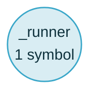

### 🌱 graft blast radius

**1 area changed → 1 area can be affected.** 1 dependent symbol, depth 2.
Tests: execute_workflow has tests the diff did not touch.



| Can be affected | Symbols | Nearest hop | Reached from |
| --- | --: | --- | --- |
| _runner | 1 | `harness-runtime/src/harness_runtime/lifecycle/child_workflow_runner.py:L185-L281` _runner — calls, depth 1 | execute_workflow |

<details>
<summary><strong>All 1 dependent symbol</strong>, grouped by area</summary>

**_runner** — 1 symbol in 1 file

- `harness-runtime/src/harness_runtime/lifecycle/child_workflow_runner.py:L185-L281` — _runner (calls, depth 1)
  ```261: return execute_workflow(```

</details>
<details>
<summary><strong>Test signal</strong> per changed area — 1 ⚠</summary>

_Reached = a node under a test path has a resolved edge into the changed symbol. It undercounts anything called indirectly — through a CLI, a spawned process or a dynamic import — so read a low ratio as “look here”, never as a coverage gate._

- ⚠ **execute_workflow** — 4 of 8 reached · 32 test files reach it, none changed here
  - not reached: `_emit_pause_captured`, `_emit_resume_attempted`, `_execute_evaluator_optimizer`, `_execute_decentralized_handoff`

</details>
<details>
<summary>32 test suites also reference this code</summary>

712 symbols, kept out of the diagram and the table so they cannot crowd out the areas a reviewer has to look at.

- `harness-cp/tests/test_cohort_key_capable.py`
- `harness-cp/tests/test_u_cp_86_88_fanout_capacity_admission.py`
- `harness-cp/tests/test_workflow_driver.py`
- `harness-cp/tests/test_workflow_driver_b65_post_effect_signing_disposition.py`
- `harness-cp/tests/test_workflow_driver_decentralized_handoff.py`
- `harness-cp/tests/test_workflow_driver_drain.py`
- `harness-cp/tests/test_workflow_driver_effect_fence_empty_key_b107.py`
- `harness-cp/tests/test_workflow_driver_effect_fence_pause.py`
- `harness-cp/tests/test_workflow_driver_effect_fence_tree_wide_abort_b80.py`
- `harness-cp/tests/test_workflow_driver_effect_fence_uniform_fallback_b70.py`
- `harness-cp/tests/test_workflow_driver_envelope.py`
- `harness-cp/tests/test_workflow_driver_evaluator_optimizer.py`
- `harness-cp/tests/test_workflow_driver_evaluator_optimizer_pause.py`
- `harness-cp/tests/test_workflow_driver_fanout_output_replay_full_chain.py`
- `harness-cp/tests/test_workflow_driver_fanout_pause.py`
- `harness-cp/tests/test_workflow_driver_handoff_pause.py`
- `harness-cp/tests/test_workflow_driver_hierarchical_delegation.py`
- `harness-cp/tests/test_workflow_driver_hitl_gate_config_hash_b79.py`
- `harness-cp/tests/test_workflow_driver_hitl_gate_config_hash_b79_slice2.py`
- `harness-cp/tests/test_workflow_driver_hitl_uniform_fallback_property4.py`
- …12 more

</details>

⚠️ 2 changed files not in the graph (.harness/forward-register.yaml, .harness/post-phase-8-forward-register.md) — no parser claims the extension, or the index predates the file.

<sub>`graft blast` · 8989ef59ebd7408ccd8b97c66d98e074c0cb9558...HEAD · depth 2 · 5 changed files</sub>
