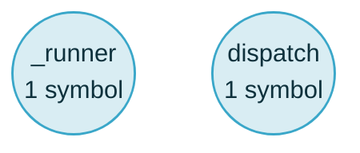

### 🌱 graft blast radius

**2 areas changed → 2 areas can be affected.** 2 dependent symbols, depth 2.
Tests: 2 areas updated their tests.



| Can be affected | Symbols | Nearest hop | Reached from |
| --- | --: | --- | --- |
| _runner | 1 | `harness-runtime/src/harness_runtime/lifecycle/child_workflow_runner.py:L185-L281` _runner — calls, depth 1 | execute_workflow |
| dispatch | 1 | `harness-runtime/src/harness_runtime/bootstrap/factories/r_cxa_2_producer_loop_factory.py:L162-L205` dispatch — calls, depth 1 | execute_workflow |

<details>
<summary><strong>All 2 dependent symbols</strong>, grouped by area</summary>

**_runner** — 1 symbol in 1 file

- `harness-runtime/src/harness_runtime/lifecycle/child_workflow_runner.py:L185-L281` — _runner (calls, depth 1)
  ```219: # B-FANOUT-CRASH-RESUME-MAYBE-RAN-SUBAGENT (R-FS-1) — on a FIRST dispatch```

**dispatch** — 1 symbol in 1 file

- `harness-runtime/src/harness_runtime/bootstrap/factories/r_cxa_2_producer_loop_factory.py:L162-L205` — dispatch (calls, depth 1)
  ```162: async def dispatch(```

</details>
<details>
<summary><strong>Test signal</strong> per changed area — 2 ✓</summary>

_Reached = a node under a test path has a resolved edge into the changed symbol. It undercounts anything called indirectly — through a CLI, a spawned process or a dynamic import — so read a low ratio as “look here”, never as a coverage gate._

- ✓ **execute_workflow** — 10 of 18 reached · 4 test files changed here: `harness-cp/tests/test_b71_escalation_correlation_carriers_u_cp_102.py`, `harness-runtime/tests/test_b71_escalation_token_mint_and_fold_u_rt_155.py`, `harness-runtime/tests/test_b71_escalation_token_rides_the_tracing_export.py`, `harness-runtime/tests/test_lifecycle_hitl_gate_composer.py`
  - not reached: `_omit_absent_escalation_instance_id`, `diagnose_token_keyed_ingress`, `from_pause_state`, `_walk`, `_diagnose_validator_supplied_token_overwritten`, `_pause_signal_escalation_instance_id`, `_cancel_branch`, `_cancel_worker`
- ✓ **dispatch** — 7 of 9 reached · 3 test files changed here: `harness-runtime/tests/test_b71_escalation_token_mint_and_fold_u_rt_155.py`, `harness-runtime/tests/test_b71_escalation_token_rides_the_tracing_export.py`, `harness-runtime/tests/test_lifecycle_hitl_gate_composer.py`
  - not reached: `_escalation_operator_surface`, `_EscalationOperatorSurface`

</details>
<details>
<summary>92 test suites also reference this code</summary>

1304 symbols, kept out of the diagram and the table so they cannot crowd out the areas a reviewer has to look at.

- `harness-cp/tests/test_b71_resolvability_cannot_be_a_static_stamp.py`
- `harness-cp/tests/test_cohort_key_capable.py`
- `harness-cp/tests/test_hitl_placement.py`
- `harness-cp/tests/test_pause_resume_protocol_types.py`
- `harness-cp/tests/test_pause_state_projection_b69.py`
- `harness-cp/tests/test_u_cp_71_hitl_gate_signature.py`
- `harness-cp/tests/test_u_cp_73_invariant_2_carve_out.py`
- `harness-cp/tests/test_u_cp_86_88_fanout_capacity_admission.py`
- `harness-cp/tests/test_validator_framework.py`
- `harness-cp/tests/test_validator_framework_post_evaluate_hook.py`
- `harness-cp/tests/test_validator_framework_types.py`
- `harness-cp/tests/test_workflow_driver.py`
- `harness-cp/tests/test_workflow_driver_b65_post_effect_signing_disposition.py`
- `harness-cp/tests/test_workflow_driver_branch_metadata_cadence.py`
- `harness-cp/tests/test_workflow_driver_branch_substrate.py`
- `harness-cp/tests/test_workflow_driver_buffered_append.py`
- `harness-cp/tests/test_workflow_driver_cascade_policy.py`
- `harness-cp/tests/test_workflow_driver_decentralized_handoff.py`
- `harness-cp/tests/test_workflow_driver_drain.py`
- `harness-cp/tests/test_workflow_driver_effect_fence_empty_key_b107.py`
- …72 more

</details>

⚠️ 3 changed files not in the graph (.harness/arc-metrics.jsonl, .harness/forward-register.yaml, .harness/post-phase-8-forward-register.md) — no parser claims the extension, or the index predates the file.

<sub>`graft blast` · 035f99db4f4ae08a524b2e522675f4a7b3e35a45...HEAD · depth 2 · 16 changed files</sub>
